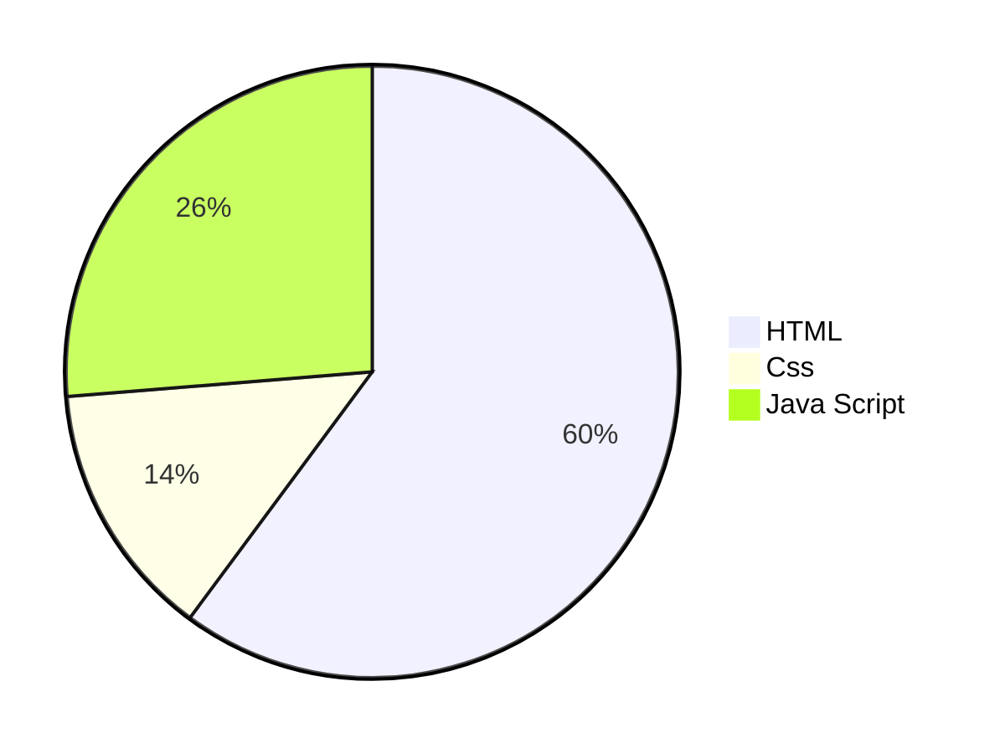

<table align="center"><tr>
  <td>

 
  Arcade Hub

 </td>
</tr>
</table>
<h1 align="center">Google Arcade Hub</h1>
<h3 align="center">Google Cloud Arcade Unofficial Site</h3>

 
  Arcade Point Calculator

<h3 align="center">Get a custom made Arcade Point Calculator</h3>

<table align="center">
  <tr>
    <td><strong>Version :</strong></td>
    <td>

 

</td>
  <td> <strong>Deplying Site :</strong> </td>
<td>

 

</td>
  </tr>
</table>
<table align="center">
  <tr>
    <td> <strong>Used Languages :</strong> </td>
    <td>
      

    

    </td>
  </tr>
</table>

<table align="center">
<tr>
<th> 🔗 <strong>Deplyed Websites :</strong> </th>
</tr>
<tr>

<td>

| Google Arcade Hub |
|--|
||
</td></tr> </table>

 

> [!NOTE]
> This reposiratory is for practicing advanced web building practicing.

> [!CAUTION]
> All (c) copyrights are reserved by Sankha Saha (CODR):  

<h1 aign="center">All details regarding development : </h1>

# Used Languages in percent :

